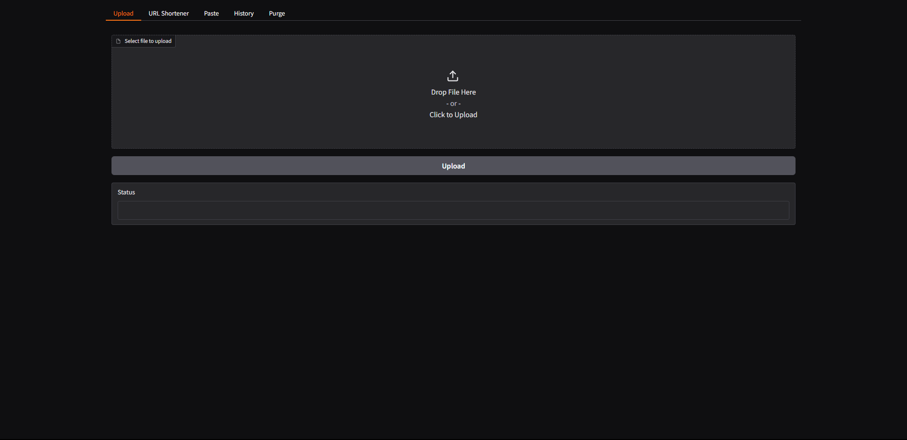

# 🚀 E-Z DASH MANAGER

[](https://www.python.org/)
[](https://gradio.app/)
[](LICENSE)
[](https://github.com/cocothepoco/E-Z-Tools/graphs/commit-activity)
[](https://discord.gg/ezhost)

<div align="center">
  
  
  
  
  
  
</div>

A modern interface for E-Z.host file hosting service, featuring file uploads, URL shortening, and paste creation.



## ✨ Features

- 📤 **File Upload**: Upload files to E-Z.host with ease
- 🔗 **URL Shortener**: Create shortened URLs
- 📝 **Paste Creation**: Share text with syntax highlighting
- 📊 **History Tracking**: Keep track of all your uploads
- 🗑️ **Bulk Purge**: Remove multiple files at once

## 🚀 Getting Started

### Prerequisites

```bash
pip install gradio requests
```

### Running the Application

1. Clone the repository:
```bash
git clone https://github.com/cocothepoco/E-Z-Tools.git
cd E-Z-Tools
```

2. Run the script:
```bash
python script.py
```

3. Open your browser to the displayed URL (usually http://127.0.0.1:7860)

## 💡 Usage

### File Upload
1. Go to the "Upload" tab
2. Click "Select file to upload" or drag & drop your file
3. Click "Upload"
4. Copy the provided URL

### URL Shortening
1. Navigate to the "URL Shortener" tab
2. Paste your long URL
3. Click "Shorten"
4. Use the shortened URL

### Creating Pastes
1. Go to the "Paste" tab
2. (Optional) Set a title and language for syntax highlighting
3. Enter your text content
4. Click "Create Paste"
5. Share the generated URL

### Managing History
- View all uploads in the "History" tab
- Click "Refresh History" to update the list
- Use the "Purge" tab to delete multiple files (use with caution)

## 🔑 API Configuration

The tool uses the E-Z.host API. To use your own API key:

1. Replace the API key in the enviroment file:
```python
API_KEY=
```

## 🛠️ Installation

### Automatic Setup (Windows)

1. Download or clone this repository
2. Double-click `Setup.bat`
3. Follow the on-screen instructions

### Manual Setup

1. Install Python 3.8 or newer
2. Clone the repository:
```bash
git clone https://github.com/cocothepoco/E-Z-Tools.git
cd E-Z-Tools
```

3. Install the required packages:
```bash
pip install -r requirements.txt
```

4. Run the script:
```bash
python script.py
```

5. Open your browser to the displayed URL (usually http://127.0.0.1:7860)

## 🛟 Support

For support, please visit [E-Z.host Discord](https://discord.gg/ez) or open an issue in this repository.

## 📜 License

This project is licensed under the MIT License - see the [LICENSE](LICENSE) file for details.

## 🙏 Acknowledgments

- [E-Z.host](https://e-z.host) for providing the file hosting service
- [Gradio](https://gradio.app) for the web interface framework
